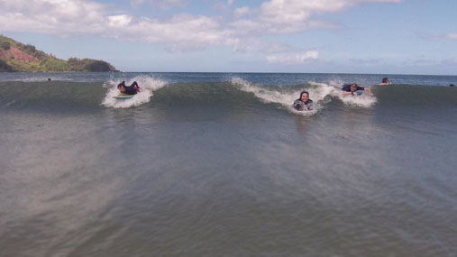
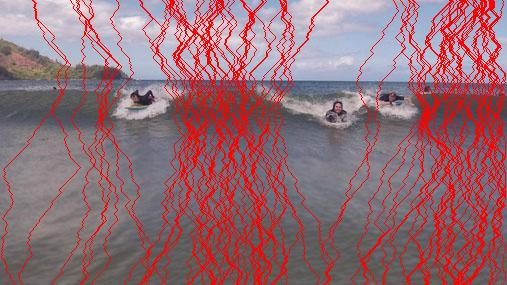

# seamcarver

A Python package and command-line interface for content-aware image resizing with seam carving.

`seamcarver` removes low-information pixel paths (seams) instead of uniformly scaling or naively cropping, helping preserve visually important content. The implementation combines dynamic-programming seam search, pluggable energy functions, and a modular API/CLI architecture for experimentation and practical use.

## Additional Documentation

Detailed engineering documentation is available in the [`docs/`](docs/) directory:

- [Architecture Overview](docs/architecture.md)
- [Design Decisions](docs/design-decisions.md)
- [Optimization Notes](docs/optimization-notes.md)
- [Benchmark Methodology](docs/benchmarking.md)
- [Algorithm Walkthrough](docs/algorithm-overview.md)

## Visual Examples

| Original | Resized (content-aware) |
| --- | --- |
|  |  |

| Seam Overlay |
| --- |
|  |

## Overview

Seam carving finds connected pixel paths with minimal cumulative energy and removes them iteratively to resize images while preserving salient structures. This repository provides:

- A reusable Python library (`SeamCarver`) for integration into scripts and applications
- A CLI (`seamcarver`) for direct image processing workflows
- Extensible energy-method abstractions for algorithm experimentation
- A dynamic-programming seam computation pipeline with batch seam handling

## Features

- Content-aware image resizing via seam carving
- Vertical and horizontal seam removal
- Seam highlighting for visualization/debugging
- Pluggable energy methods:
  - `GradientEnergy`
  - `SobelEnergy`
  - `LaplacianEnergy`
- Dynamic-programming cumulative-cost computation and seam backtracking
- Batch seam extraction and mask-based seam removal
- CLI logging controls: `--verbose`, `--quiet`, `--log-file`
- Python API and packaged distribution via `pyproject.toml`

## Installation

```bash
pip install seamcarver
```

## Quick Start

```bash
seamcarver examples/medium.jpg resize 240 400 --output resized.jpg
```

## CLI Usage

```bash
seamcarver <input> <command> [options]
```

### Commands

- `resize <height> <width>`: resize image to target dimensions
- `remove --direction {vertical,horizontal} --count N`: remove `N` seams
- `highlight --direction {vertical,horizontal} --count N [--rgb R G B]`: highlight seams

### Common options

- `-o, --output <path>` optional output path; omit it to process without saving
- `-v, --verbose` debug-level logs
- `-q, --quiet` warnings/errors only
- `-l, --log-file <path>` write logs to file

## Library Usage

```python
from seamcarver import SeamCarver, SobelEnergy

carver = SeamCarver("examples/medium.jpg", method=SobelEnergy())
carver.resize(height=240, width=400)
carver.save("resized.jpg")
```

## Architecture

### `SeamCarver` (`seamcarver/core.py`)

High-level orchestration layer that handles image I/O, seam operations, highlighting, saving/displaying, and horizontal processing through transpose abstraction.

### `SeamCalculator` (`seamcarver/calculator.py`)

Core algorithm layer that computes energy maps, builds cumulative DP cost tables, backtracks minimum seams, and returns seam masks for removal/highlighting.

### Energy interface + implementations (`seamcarver/methods/`)

`EnergyMethod` defines the energy-function contract; concrete implementations (`GradientEnergy`, `SobelEnergy`, `LaplacianEnergy`) are interchangeable strategies.

### CLI layer (`seamcarver/cli.py`)

Argument parsing, command routing, logging setup, and operational error handling.

## Seam Carving Algorithm Overview

1. Compute an energy map from the current image.
2. Build cumulative minimum costs row-by-row with dynamic programming.
3. Backtrack from the lowest-cost endpoint to recover the minimum seam.
4. Convert seam locations into masks and remove/highlight seam pixels.
5. Repeat iteratively until the requested resize/removal target is reached.

## Energy Methods

- **GradientEnergy**: gradient-magnitude based pixel importance
- **SobelEnergy**: Sobel operator on grayscale image
- **LaplacianEnergy**: Laplacian operator on grayscale image

Custom methods can be added by subclassing `EnergyMethod` and implementing `__call__(image) -> np.ndarray`.

## Optimization Notes

Current implementation includes several practical optimizations:

- Vectorized cumulative-cost updates in DP row transitions
- Transpose-based abstraction to unify horizontal/vertical seam logic
- In-place seam invalidation (`np.inf`) during multi-seam extraction
- Boolean-mask reshape strategy for seam removal
- Adaptive seam batch sizing logic based on image width

## Benchmarking

Benchmark tooling is configured in `pyproject.toml` via `pytest-benchmark`, and benchmark fixtures are defined in `benchmarks/conftest.py`.

To run benchmarks:

```bash
pytest benchmarks
```

### Results (template)

#### Seam Removal Benchmark Results

| Image Size   | 10 seams | 20 seams | 40 seams | 80 seams | 160 seams |
|--------------|----------|----------|----------|----------|-----------|
| 256x256      | 0.024s   | 0.036s   | 0.069s   | 0.128s   | 0.247s    |
| 512x512      | 0.062s   | 0.089s   | 0.148s   | 0.279s   | 0.532s    |
| 1024x1024    | 0.192s   | 0.244s   | 0.370s   | 0.623s   | 1.193s    |

> Times reflect random RGB images, running on Macbook Air M2.  
> Seam removal scales linearly with seam count for a fixed image size.

## Repository Structure

- `seamcarver/core.py`  
  Public orchestration API for seam carving operations.
- `seamcarver/calculator.py`  
  Dynamic-programming seam search and seam-mask generation.
- `seamcarver/methods/`  
  Energy abstraction (`EnergyMethod`) and method implementations.
- `seamcarver/cli.py`  
  Command-line interface and operational logging.
- `seamcarver/constants.py`, `seamcarver/utils.py`, `seamcarver/logger.py`  
  Shared constants, helper utilities, and logging configuration.
- `tests/`  
  Unit/integration tests for API and CLI behavior.
- `benchmarks/`  
  Benchmark fixtures and performance test support.
- `examples/`  
  Sample images and generated visual outputs.

## Limitations

- Current implementation supports seam **removal** (not seam insertion/expansion).
- Quality depends on the selected energy method and image content.
- Extreme reductions can still introduce visual artifacts.

## Future Work

- Seam insertion for content-aware expansion
- Forward-energy variants and additional energy models
- Larger benchmark suite and published reference results
- Optional GPU/parallel acceleration experiments

## License

MIT License. See `LICENSE`.

## Attributions

- Algorithm concept: [Seam Carving (Wikipedia)](https://en.wikipedia.org/wiki/Seam_carving)
