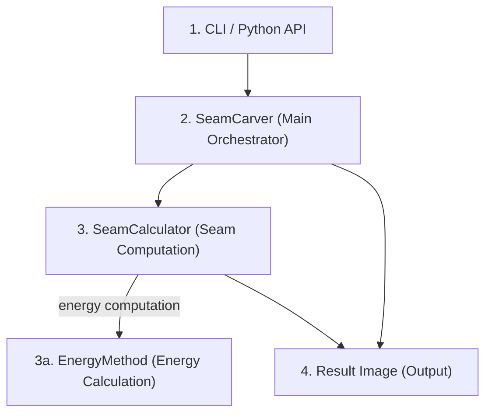

# Architecture

This document describes the current architecture of the `seamcarver` repository, with emphasis on decomposition, responsibilities, and data/control flow.

The core architecture follows a straightforward, linear pipeline:
User input is received via the CLI or Python API, passed to the central SeamCarver orchestrator, which coordinates energy map calculation and seam identification through dedicated components. The result—a resized image—is then returned or saved.

## 1. System decomposition

The repository is organized into four primary layers:

1. **CLI boundary (`seamcarver/cli.py`)**  
   Parses commands/options, configures logging, maps user intent to library operations, and handles CLI-facing failures (`seamcarver/cli.py:20-80`, `82-129`, `130-160`).

2. **Orchestration layer (`SeamCarver` in `seamcarver/core.py`)**  
   Owns image state and high-level operations (`resize`, `remove`, `highlight`, `display`, `save`) and delegates seam finding to `SeamCalculator` (`seamcarver/core.py:35-50`, `125-168`).

3. **Algorithm layer (`SeamCalculator` in `seamcarver/calculator.py`)**  
   Computes seam masks using energy-map generation, cumulative-cost dynamic programming, and backtracking (`seamcarver/calculator.py:77-127`, `185-240`).

4. **Energy strategy layer (`seamcarver/methods/`)**  
   Defines the `EnergyMethod` interface and concrete implementations (`GradientEnergy`, `SobelEnergy`, `LaplacianEnergy`) (`seamcarver/methods/interface.py:13-35`, `seamcarver/methods/gradient.py:16-31`, `seamcarver/methods/sobel.py:16-30`, `seamcarver/methods/laplacian.py:16-29`).

Private boundary modules normalize image inputs (`src/seamcarver/_image.py`) and
operation parameters (`src/seamcarver/_validation.py`). Other supporting modules
provide constants and logging.

## 2. High-level responsibilities

### 2.1 `SeamCarver`

- Accepts ndarray, nested-list, PIL image, string-path, and `os.PathLike` inputs
  (`src/seamcarver/_image.py`, `normalize_image`).
- Owns an RGB `uint8` NumPy array shaped `(height, width, 3)`. NumPy inputs must
  already satisfy that contract. Integer lists are validated before conversion;
  PIL images and file inputs are converted to RGB.
- Accepts integer-like operation parameters at public boundaries. The validation
  module converts them to built-in `int` values before algorithmic processing.
- Exposes public image operations:
  - `resize(height, width)` validates both targets before shrinking and restores
    the original image if processing fails.
  - `remove(direction, num_seams)` removes seam pixels using the returned mask.
  - `highlight(direction, num_seams, color)` marks seam pixels.
  - `add(direction, num_seams)` is reserved for future work and currently raises
    `NotImplementedError`.
- Owns the `SeamCalculator` instance (`seamcarver/core.py:111-113`).

### 2.2 `SeamCalculator`

- Encapsulates seam-search computation and is callable (`__call__`) for a requested seam count (`seamcarver/calculator.py:77-83`).
- Uses configured `EnergyMethod` for energy map computation (`seamcarver/calculator.py:179-183`).
- Builds cumulative cost table with row-wise DP transitions (`seamcarver/calculator.py:185-201`).
- Backtracks minimum seams from the final row and invalidates chosen seam pixels with `np.inf` to support repeated extraction (`seamcarver/calculator.py:204-239`).
- Returns seam positions as a boolean mask in the original image coordinate space (`seamcarver/calculator.py:106-127`).

### 2.3 `EnergyMethod` and implementations

- `EnergyMethod` defines the pluggable contract: `__call__(image) -> energy_map` (`seamcarver/methods/interface.py:33-50`).
- `GradientEnergy` computes gradient-magnitude-like interior energy with fixed border energy (`seamcarver/methods/gradient.py:23-31`, `seamcarver/constants.py:14-15`).
- `SobelEnergy` and `LaplacianEnergy` convert to grayscale then apply SciPy operators (`seamcarver/methods/sobel.py:25-30`, `seamcarver/methods/laplacian.py:25-29`).

## 3. Data flow (images, energy maps, seams, masks)

1. **Input ingestion**  
   CLI reads `input` path and constructs `SeamCarver` (`seamcarver/cli.py:42-43`, `91-94`).

2. **In-memory image state**  
   `SeamCarver.image` is the mutable source of truth (`seamcarver/core.py:53-54`, `120-123`).

3. **Direction normalization**  
   Horizontal requests use a local transposed view. The stored image is updated
   only after seam processing succeeds (`src/seamcarver/core.py`, `_orient_image`).

4. **Energy map generation**  
   `SeamCalculator` calls the configured energy method and receives a 2D energy table (`seamcarver/calculator.py:179-183`).

5. **Seam extraction loop**  
   For each seam: compute costs, backtrack minimum path, mark path in seam mask, invalidate energy values (`seamcarver/calculator.py:143-150`, `204-239`).

6. **Mask reconstruction and application**  
   Calculator reconstructs original-coordinate seam mask (`seamcarver/calculator.py:123-127`), then:
   - `remove`: drops masked pixels and reshapes (`seamcarver/core.py:145-148`)
   - `highlight`: writes highlight color into masked pixels (`seamcarver/core.py:159-160`, `seamcarver/constants.py:16-17`)

7. **Output boundary**  
   Result image is saved by `SeamCarver.save`, invoked by CLI (`seamcarver/core.py:166-168`, `seamcarver/cli.py:123-125`).

## 4. Control flow

- CLI command dispatch:
  - `resize` → `SeamCarver.resize`
  - `remove` → `SeamCarver.remove`
  - `highlight` → `SeamCarver.highlight` (+ display)  
  (`seamcarver/cli.py:99-121`)
- `resize` validates both dimensions, then performs only the required directional
  removals. Equal dimensions are no-ops; larger dimensions are rejected.
- `SeamCalculator.__call__` iterates until requested seams are processed, using `_process` to extract as many seams as possible before image compaction (`seamcarver/calculator.py:112-122`, `129-155`).

## 5. Extensibility boundaries

- **Primary extension point**: add new energy strategies by subclassing `EnergyMethod` and passing instances into `SeamCarver(method=...)` or `SeamCalculator(method=...)` (`seamcarver/methods/interface.py:13-35`, `seamcarver/core.py:61-65`, `seamcarver/calculator.py:67-75`).
- **Public API boundary**: package exports only key symbols (`SeamCarver`, direction constants, energy interface and built-ins), keeping internal helpers non-public (`seamcarver/__init__.py:64-72`).
- **CLI boundary**: command vocabulary and logging behavior are isolated from algorithm internals (`seamcarver/cli.py:35-77`, `seamcarver/logger.py:8-63`).
