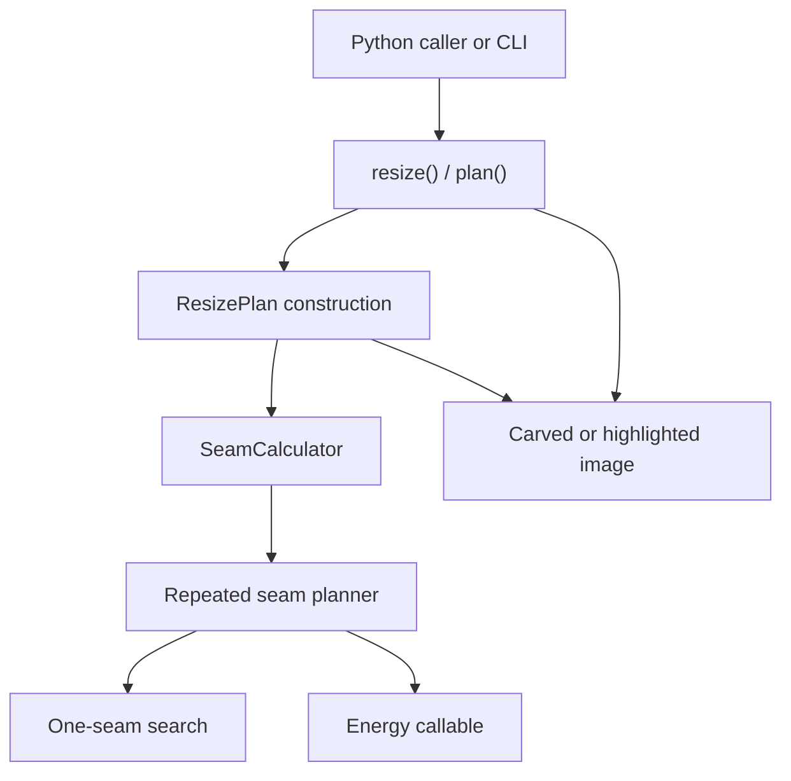

# Architecture

`seamcarver` separates input/output concerns, public resize orchestration,
repeated seam planning, one-seam search, and energy calculation.

```mermaid
flowchart TD
    Client["Python caller or CLI"]
    Core["resize() / plan()"]
    Plan["ResizePlan construction"]
    Calculator["SeamCalculator"]
    Planner["Repeated seam planner"]
    Search["One-seam search"]
    Energy["Energy callable"]
    Result["Carved or highlighted image"]

    Client --> Core
    Core --> Plan
    Plan --> Calculator
    Calculator --> Planner
    Planner --> Search
    Planner --> Energy
    Plan --> Result
    Core --> Result
```

## Components

### Public operations

`src/seamcarver/core.py` exposes two ordinary entry points:

- `resize()` normalizes an image, validates target dimensions, builds a plan,
  and returns an owned carved image.
- `plan()` returns a `ResizePlan` when callers need both the carved result and a
  preview based on the same seam decisions.

Neither operation mutates the caller's input.

### Resize plans

`src/seamcarver/_plan.py` owns multi-direction resize orchestration and the
`ResizePlan` result. A plan stores independent source, result, and removal-mask
arrays. Its internal arrays are read-only; `result()` and `preview()` return
owned copies.

Width reduction runs first. Height reduction transposes the current image and
source-coordinate map, reuses vertical seam processing, then restores the
original orientation.

### Seam calculation

`src/seamcarver/calculator.py` validates an energy callable's output and delegates
repeated removal to the private planner. It returns a boolean mask in source-image
coordinates and does not mutate its input.

`src/seamcarver/_planner.py` owns repeated energy computation, seam removal, and
source-coordinate tracking. Public operations recompute energy after every seam.

`src/seamcarver/_search.py` contains the dynamic-programming cost calculation and
one-seam backtracking logic.

### Energy callables

`src/seamcarver/methods/` contains the built-in gradient, Sobel, and Laplacian
methods. Plain functions and callable objects are also accepted. The calculator
requires a finite, real, two-dimensional numeric map matching the current image
height and width.

### Input and validation boundaries

`src/seamcarver/_image.py` converts supported inputs into owned RGB `uint8`
arrays. `src/seamcarver/_validation.py` handles integer-like dimensions, seam
counts, and RGB colors.

### CLI boundary

`src/seamcarver/cli.py` owns command parsing, filesystem input/output, logging,
and user-facing failures. It maps commands onto the functional API:

- `resize` passes target dimensions to `resize()`.
- `remove` converts direction and count to target dimensions, then carves a plan.
- `highlight` passes target dimensions to `plan()`, then previews the pixels that
  resizing would remove.

The CLI keeps direction strings at its boundary. The Python API does not expose
numeric direction constants.

## Data flow

1. A caller supplies an image and target dimensions.
2. Input normalization creates an owned RGB `uint8` array.
3. Target validation rejects zero, negative, or enlarged dimensions.
4. The plan builder removes width seams, followed by height seams when needed.
5. Each removal recomputes energy, finds one connected seam, and updates the
   working image and source-coordinate map.
6. `ResizePlan` stores the final image and a source-sized removal mask.
7. The caller receives an owned carved or highlighted image.

Errors propagate without exposing a partial result or mutating the source input.

## Public boundaries

The top-level public surface is:

- `resize`
- `plan` and `ResizePlan`
- the built-in energy methods
- `__version__`

`SeamCalculator` remains available from `seamcarver.calculator`, and
`EnergyMethod` remains available from `seamcarver.methods`.

The mutable `SeamCarver` compatibility class and numeric direction constants
were retired during beta. The intended distribution remains unreleased, so the
version will be chosen during release preparation.

Internal seam arrays, source-coordinate maps, cost tables, planner controls, and
default implementation constants remain private.
